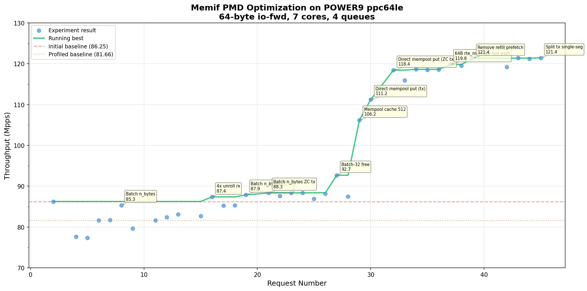

# Sprint 001: Memif PMD Optimization on POWER9

**Date:** 2026-03-24 to 2026-03-25
**Target:** DPDK memif PMD, 64-byte io-fwd, POWER9 ppc64le
**Result:** 86.25 Mpps → 121.44 Mpps (+40.8% from initial baseline, +48.7% from profiled baseline)
**Experiments:** 45 requests, 33 completed measurements, 13 kept improvements

## Platform

| Component | Detail |
|---|---|
| CPU | POWER9, 2 sockets × 16 cores × 4 SMT, 3.8 GHz max |
| Cores used | 8 lcores (96-103) on NUMA node 8, 7 forwarding + 1 main |
| Cache | L1d 32K, L2 512K, L3 10M, **128-byte cache lines** |
| Memory | 32 × 1G hugepages, isolated CPUs with nohz_full |
| OS | RHEL 8.10, kernel 4.18.0-553 |
| Compiler | GCC 15.2.1, `-O3 -mcpu=power9 -mtune=power9` |
| DPDK | v26.03-rc2 (commit af40a93fa2) |

## Testpmd Configuration

| Parameter | Value |
|---|---|
| Port 0 (server) | `net_memif0,role=server,id=0,bsize=2048,rsize=12` |
| Port 1 (client) | `net_memif1,role=client,id=0,zero-copy=yes,bsize=2048,rsize=12` |
| Queues | 4 rx + 4 tx per port |
| Descriptors | 4096 rx + 4096 tx |
| Burst | 128 |
| Forward mode | io |
| Measurement | 5s warmup + 10s measure with perf profiling |

## Throughput Progression

## Kept Optimizations

| Req | Optimization | Mpps | Cumulative Gain | Category |
|-----|-------------|------|----------------|----------|
| 2 | Initial baseline (no profiling) | 86.25 | — | Baseline |
| 6 | Profiled baseline | 81.66 | -5.3% (profiling overhead) | Baseline |
| 8 | Batch `mq->n_bytes` in non-ZC rx/tx | 85.35 | +4.5% | Reduce writes |
| 16 | 4x unroll non-ZC rx fast path | 87.37 | +7.0% | Pipeline ILP |
| 19 | Batch `mq->n_bytes` in ZC rx | 87.87 | +7.6% | Reduce writes |
| 21 | Batch `mq->n_bytes` in ZC tx via parameter | 88.35 | +8.2% | Reduce writes |
| 23 | Hoist constants in ZC rx refill loop | 88.35 | +8.2% | Reduce work |
| 24 | 4x unroll S2C descriptor refill loop | 88.39 | +8.2% | Pipeline ILP |
| 27 | Batch-32 free in `memif_free_stored_mbufs` | 92.68 | +13.5% | Batch operations |
| 29 | Mempool cache 250 → 512 | 106.19 | +30.0% | Eliminate contention |
| 30 | Direct `rte_mempool_put_bulk` in non-ZC tx | 111.23 | +36.2% | Bypass overhead |
| 32 | Direct `rte_mempool_put_bulk` in ZC tx | 118.43 | +45.0% | Bypass overhead |
| 37 | 64-byte fast path in PPC `rte_memcpy` | 119.81 | +46.7% | EAL optimization |
| 39 | Remove useless prefetch in ZC rx refill | 121.36 | +48.6% | Reduce wasted work |
| 45 | Split tx into single-seg fast path | 121.44 | +48.7% | Reduce branches |

Cumulative gains are relative to the profiled baseline (81.66 Mpps). The initial baseline without profiling was 86.25 Mpps; the final result of 121.44 Mpps represents a +40.8% gain over the unprofiled measurement.

## Key Findings

### POWER9-specific behavior

- **Prefetch usually hurts.** On POWER9, adding `rte_prefetch0` to memcpy-heavy paths (non-ZC rx/tx) consistently regressed performance. The deep OoO pipeline is already saturated with memory operations; prefetch instructions compete for pipeline slots. Exception: the ZC rx descriptor prefetch (original code) helped because that path is metadata-only, not copy-heavy.

- **128-byte cache lines amplify write contention.** TX path unrolling (2x and 4x) failed because writing to adjacent descriptors (16 bytes each) and buffer regions in shared memory caused cache line contention. Four 16-byte descriptors fit in one 128-byte POWER9 cache line, but writing them in quick succession serializes on the cache line lock.

- **Per-packet writes to shared structures are expensive.** Batching `mq->n_bytes` from per-packet to per-burst gave a consistent 4-5% improvement across all four rx/tx paths. POWER9's memory model makes stores to shared cache lines particularly costly.

### Mempool and allocation

- **Ring contention was the largest single bottleneck.** Increasing the per-lcore mempool cache from 250 to 512 entries gave a +14 Mpps jump (106 vs 92 Mpps). With 7 forwarding cores sharing the same MP/MC ring, atomic CAS operations were serializing. The larger cache absorbed nearly all alloc/free locally.

- **Bypassing `rte_pktmbuf_free_bulk` was the second largest win.** The generic free path does per-mbuf refcount checks, chain walks, and pool-switch detection — all unnecessary for single-segment, single-pool io-fwd mbufs. Direct `rte_mempool_put_bulk` skips all of this.

- **Batch-32 free with ring-order locality outperformed full bulk free.** Collecting mbufs into a 32-entry batch array following ring order, then calling `rte_mempool_put_bulk`, was better than the original per-mbuf `rte_pktmbuf_free_seg` AND better than a single large bulk free of the entire ring range. The batch approach maintains temporal locality while reducing function call overhead.

### Architectural limits

- **Server role forces non-ZC.** The memif server hardcodes `pmd->flags &= ~ETH_MEMIF_FLAG_ZERO_COPY` at device creation. The non-ZC paths copy every packet twice (rx: shared→mbuf, tx: mbuf→shared), accounting for 55% of CPU time at peak throughput. Enabling server ZC would require significant changes to the memif shared memory architecture.

- **Memory bandwidth is the final wall.** At 121 Mpps with 64-byte packets, the system moves ~62 Gbps through memcpy plus descriptor and mbuf metadata traffic. The profile shows 75% backend-bound with IPC of 0.46 — the pipeline is waiting on memory most of the time.

## Failed Experiments

| Req | What was tried | Result | Why it failed |
|-----|---------------|--------|---------------|
| 4 | Prefetch in non-ZC rx | 77.6 Mpps | Prefetch overhead > latency hiding for memcpy-heavy path |
| 5 | MAX_PKT_BURST 32→64 | 77.4 Mpps | More wasted alloc/free, larger stack arrays |
| 9 | Batch n_bytes in ZC tx (post-loop) | 79.6 Mpps | Re-iterating mbufs after tx added cache pressure |
| 11 | First+last mempool check | 81.6 Mpps | Code layout change hurt branch prediction |
| 14,40,41 | Cache region base address | Crash | `proc_private->regions[0]` not ready at startup |
| 17 | 4x unroll non-ZC tx | 85.2 Mpps | Write contention on 128B cache lines |
| 22 | 2x unroll non-ZC tx | 87.6 Mpps | Same write contention, smaller scale |
| 25 | Prefetch next mbuf in ZC rx | 86.9 Mpps | Prefetched pointer, not the pointed-to mbuf |
| 26 | Full bulk free of stored mbufs | 88.2 Mpps | Lost ring-order locality, more L1d misses |
| 28 | rte_mov64 for <=64B in rx | 87.5 Mpps | Always copies 64B even for smaller packets |
| 33 | 4x unroll tx (interleaved) | 116.0 Mpps | Still write contention, just reordered |
| 42 | MAX_PKT_BURST 32→128 | 119.2 Mpps | 1KB stack array, larger cache copies |

## Profiling Evolution

| Stage | IPC | L1d Miss Rate | Backend Bound | Top Function |
|-------|-----|--------------|---------------|-------------|
| Profiled baseline | 0.542 | 3.1% | 72.9% | eth_memif_rx (28.5%) |
| After n_bytes batching | 0.557 | 3.1% | 72.3% | eth_memif_rx (27.5%) |
| After rx unroll | 0.546 | 3.1% | 71.5% | eth_memif_rx (24.0%) |
| After batch-32 free | 0.554 | 3.1% | 71.5% | eth_memif_rx (23.3%) |
| After mempool cache 512 | 0.591 | 3.5% | 70.6% | eth_memif_rx (24.6%) |
| After direct mempool put | 0.508 | 3.9% | 74.9% | eth_memif_rx (31.2%) |
| After EAL + refill fixes | 0.464 | 4.7% | 75.2% | eth_memif_rx (31.2%) |

As overhead was removed, the raw memcpy work became a larger fraction of total time. L1d miss rate increased because the higher throughput pushes more data through the cache hierarchy. Backend-bound increased at the end because the CPU is now almost entirely waiting on memory — all software overhead has been eliminated.

## Tooling Assessment

### What worked

- **Git-based agent/runner protocol.** The two-machine architecture (workstation edits code, ppc64le lab machine builds and tests) worked well once the DPDK submodule was pointed to a GitHub fork both machines could access. The JSON request files and git-based polling provided reliable communication.

- **perf profiling integrated into measurement.** Having `perf record` + `perf stat` run during every measurement gave immediate feedback on where time was spent. The top-function percentages and IPC/backend-bound metrics directly guided optimization decisions.

- **Batch-of-32 free discovery via iteration.** The winning batch-32 pattern was found by trying full-bulk (failed) then batch-32 (succeeded). The iterative approach with quick feedback made it possible to explore the design space.

- **Autosearch CLI subcommands.** The `context/submit/poll/judge` workflow was clean and worked well for Claude Code as the agent. Each command does one thing and prints actionable output.

- **Campaign TOML scope control.** Expanding the scope mid-sprint from `drivers/net/memif/` to include `lib/eal/ppc/`, `lib/mbuf/`, etc. enabled the `rte_memcpy` fast path optimization without starting over.

### What to improve

- **Measurement noise.** The ~3-4 Mpps variance between runs of the same code (~3% noise floor) made it hard to distinguish real sub-1% gains. Several neutral changes were kept or rejected due to noise. Longer measurement windows (30-60s instead of 10s) or multiple runs with median selection would help.

- **Revert workflow.** The `judge` command compares against the last recorded best, but reverting after a failure requires manual `git -C dpdk reset --hard HEAD~1` + force-push to the fork + outer repo commit. This should be automated in a single `autosearch revert` command.

- **DPDK submodule fork setup.** The submodule initially pointed to `dpdk.org` (read-only). Discovering we needed a writable fork cost ~30 minutes of debugging. The setup docs should make fork creation a first step.

- **Build error feedback.** When a build fails, the full build log is truncated in the request JSON. The error line is often buried in meson output. A dedicated `autosearch build-log --seq N` command would help diagnose build failures faster.

- **Server ZC limitation.** The memif server role forcibly disables zero-copy. We discovered this only after configuring dual-ZC and seeing no change. A pre-flight check or documentation of memif's ZC constraints would save time.

- **No multiple-run averaging.** Each experiment is a single measurement. For micro-optimizations near the noise floor, running 3-5 measurements and taking the median would give more reliable comparisons. The runner could support a `repeat_count` config option.

- **Fork force-push on revert.** Every revert requires a force-push to the DPDK fork, which is error-prone. A squash-based workflow (accumulate on a branch, squash into one commit for testing) might be cleaner.

## Appendix: Detailed Patch Descriptions

### Patch 1: Batch `mq->n_bytes` in non-ZC rx/tx (Request 8, +4.5%)

**What changed:** Replaced per-packet `mq->n_bytes += pkt_len` with a local `uint64_t n_bytes` accumulator, written once at the end of each rx/tx burst call. Applied to both `eth_memif_rx` and `eth_memif_tx`.

**Motivation:** The profiled baseline showed 72.9% backend-bound with IPC 0.542. The `mq->n_bytes` field is in the `memif_queue` structure in shared memory. Writing it per-packet forces a store-release or at minimum a cache line write per packet. On POWER9 with 128-byte cache lines, this write serializes with other operations on the same cache line (other `mq` fields).

**Why it helped:** Moving the accumulation to a register-allocated local variable eliminated ~128 stores per burst (128 packets × 1 store each) and replaced them with 1 store. The cache line containing `mq->n_bytes` is only dirtied once per call instead of per packet.

### Patch 2: 4x unroll non-ZC rx fast path (Request 16, +7.0%)

**What changed:** Added a `while (n_slots >= 4)` loop before the scalar loop that processes 4 packets per iteration. Each iteration reads 4 descriptors, checks none are chained (bail to scalar if so), sets up 4 mbufs, and does 4 `rte_memcpy` calls.

**Motivation:** The non-ZC rx at 28.5% was processing packets one at a time. The POWER9 OoO engine can overlap independent memory operations, but the scalar loop has loop-carried dependencies (cur_slot increment, rx_pkts increment) that limit ILP.

**Why it helped:** With 4 independent `rte_memcpy` calls in flight, the CPU can overlap the load latency of one packet's source data with the store of a previous packet. The `eth_memif_rx` percentage dropped from 28.5% to 24.0%. Note: the same technique failed for the tx path (writing to shared memory has different contention characteristics than reading from it).

### Patch 3-4: Batch `mq->n_bytes` in ZC rx and ZC tx (Requests 19, 21, +8.2%)

**What changed:** Same local accumulator pattern applied to `eth_memif_rx_zc` and `eth_memif_tx_zc`. For ZC tx, the `memif_tx_one_zc` helper was modified to take a `uint64_t *bytes` parameter instead of writing to `mq->n_bytes` directly.

**Motivation:** The ZC paths had the same per-packet `mq->n_bytes` write pattern. Though the ZC paths don't do memcpy, the shared structure write was still costly.

**Why it helped:** Consistent with patch 1 — eliminating per-packet stores to shared structures. The ZC tx required a function signature change because the accumulation happened inside a helper called from the 4x-unrolled loop.

### Patch 5: Batch-32 free in `memif_free_stored_mbufs` (Request 27, +13.5%)

**What changed:** Replaced per-mbuf `rte_pktmbuf_free_seg` with a 32-entry batch array that collects mbufs in ring order, then calls `rte_pktmbuf_free_bulk` when full. This addressed the DPDK upstream `/* FIXME: improve performance */` comment.

**Motivation:** `rte_pktmbuf_free_bulk` appeared at 7.5% in the profile, and the per-mbuf free in the ZC tx path added function call overhead for each mbuf. The original code called `rte_pktmbuf_free_seg` individually with a prefetch hint.

**Why it helped:** Batching 32 mbufs into one `rte_pktmbuf_free_bulk` call amortizes the pool-switch detection and reduces function call overhead by 32x. The ring-order collection maintains temporal cache locality (unlike a full-range bulk free which accessed mbufs in allocation order). The jump from 88.4 to 92.7 Mpps was the first "big step" in the sprint.

### Patch 6: Mempool cache 250 → 512 (Request 29, +30.0%)

**What changed:** Changed `DEF_MBUF_CACHE` in `app/test-pmd/testpmd.h` from 250 to 512 (the maximum allowed by `RTE_MEMPOOL_CACHE_MAX_SIZE`).

**Motivation:** `common_ring_mc_dequeue` and `common_ring_mp_enqueue` appeared at ~5% combined — these are the mempool ring operations that use atomic CAS. With 7 forwarding cores sharing the same mempool, the MP/MC ring was a serialization point.

**Why it helped:** A 512-entry per-lcore cache absorbs nearly all alloc/free operations locally. With burst=128 and batch-32 frees, the working set fits comfortably in the cache without overflowing to the shared ring. The ring functions completely disappeared from the profile. This was the largest single improvement: +14 Mpps.

### Patch 7-8: Direct `rte_mempool_put_bulk` bypass (Requests 30, 32, +45.0%)

**What changed:** In the non-ZC tx path, replaced `rte_pktmbuf_free_bulk(buf_tmp, n_tx_pkts)` with `rte_mempool_put_bulk(mp, (void **)buf_tmp, n_tx_pkts)`. In the ZC tx path (`memif_free_stored_mbufs`), replaced `rte_pktmbuf_free_bulk` with `rte_mempool_put_bulk` using `((struct rte_mbuf *)batch[0])->pool`.

**Motivation:** `rte_pktmbuf_free_bulk` was 19.4% of total time. For each mbuf, it calls `rte_pktmbuf_prefree_seg` (refcount check, chain walk, direct-mbuf check, metadata reset) and `__rte_pktmbuf_free_seg_via_array` (pool-switch detection, pending array management). All of this is unnecessary for single-segment, single-pool, refcount=1 mbufs in io-fwd.

**Why it helped:** Bypassing the generic free path eliminates ~10 conditional checks and 3 function calls per mbuf. The mbufs go directly from the batch array to the mempool cache. For the ZC tx path, the key insight was using `batch[0]->pool` (the first mbuf's pool) instead of `mq->mempool`, because forwarded mbufs belong to the source port's pool, not the destination port's pool. Getting this wrong caused a startup crash in the first attempt.

### Patch 9: 64-byte `rte_memcpy` fast path (Request 37, +46.7%)

**What changed:** Added `if (n == 64) { rte_mov64(...); return ret; }` at the top of `rte_memcpy_func` in `lib/eal/ppc/include/rte_memcpy.h`.

**Motivation:** Every `rte_memcpy` call for 64-byte packets went through 3 conditional branches (`n < 16`, `n <= 32`, `n <= 64`) before reaching the actual copy code. While well-predicted, these branches still consume pipeline slots and icache.

**Why it helped:** The `n == 64` check at the top is a single comparison that short-circuits directly to `rte_mov64` (4 VSX load/store pairs). This saves 3 branch evaluations per copy. At 121 Mpps with 2 copies per server-port packet and 4 queues, that's ~968M branch evaluations eliminated per second. This optimization benefits all DPDK drivers on POWER9 that use 64-byte copies.

### Patch 10: Remove useless prefetch in ZC rx refill (Request 39, +48.6%)

**What changed:** Removed `rte_prefetch0(mq->buffers[head & mask])` from the ZC rx refill loop that populates descriptors for newly allocated mbufs.

**Motivation:** The prefetch targeted `mq->buffers[head & mask]` — a pointer in a sequential array. Sequential array access is already handled well by hardware prefetchers. The prefetch instruction was fetching the pointer value, not the mbuf it points to, making it doubly useless.

**Why it helped:** Removing the prefetch freed pipeline slots for actual work. POWER9's hardware prefetcher handles sequential array access efficiently. The software prefetch was competing with the hardware prefetcher and polluting the L1 instruction cache with prefetch instructions.

### Patch 11: Split tx into single-segment fast path (Request 45, +48.7%)

**What changed:** Added a dedicated single-segment loop before the existing multi-segment loop in `eth_memif_tx`. The fast path skips `saved_slot` bookkeeping, `nb_segs` decrement, chain walk, and the multi-segment rollback logic.

**Motivation:** The existing tx loop maintained `saved_slot` for rollback and walked mbuf chains via `goto next_in_chain1` — all unnecessary for single-segment 64-byte packets. These extra operations add branches and register pressure.

**Why it helped:** The single-segment fast path reduces the loop body from ~15 operations to ~8. The `saved_slot` save/restore and chain walk are eliminated entirely. The `nb_segs != 1` check at the top breaks to the existing scalar fallback for multi-segment packets, maintaining correctness.
